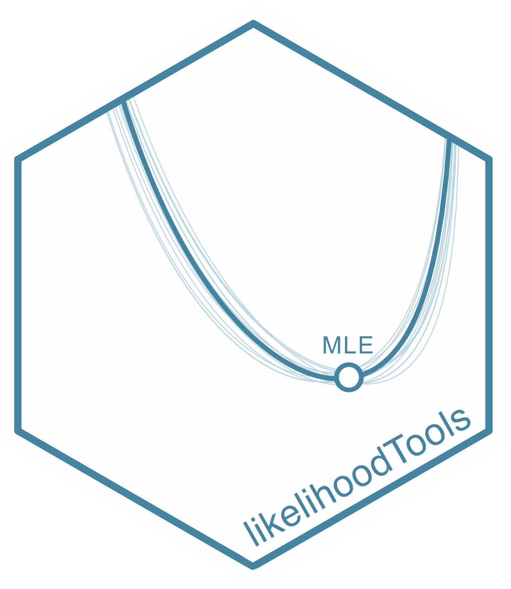

<!-- README.md is generated from README.Rmd. Please edit that file -->

```{r, include = FALSE}
knitr::opts_chunk$set(
  collapse = TRUE,
  comment = "#>",
  fig.path = "man/figures/README-",
  out.width = "100%"
)
```

# <span style="color:#43839f">likelihoodTools</span> 

# Tools for Managing Maximum Likelihood Estimation Results


<!-- badges: start -->
[](https://app.codecov.io/gh/ajpelu/likelihoodTools)
[](https://lifecycle.r-lib.org/articles/stages.html#stable)
[](https://github.com/ajpelu/likelihoodTools/actions/workflows/R-CMD-check.yaml)
[](https://www.repostatus.org/#active)
[](https://www.gnu.org/licenses/gpl-3.0)
[](https://hits.dwyl.com/ajpelu/likelihoodTools)
<!-- badges: end -->

The likelihoodTools package provides tools for managing and exploring parameter 
estimation results derived from Maximum Likelihood Estimation (MLE) using the 
[likelihood](https://CRAN.R-project.org/package=likelihood) package. This package simplifies analysis workflows by offering 
functions that support the organization, visualization, and summary of MLE 
outcomes, aiding in deeper statistical insights.

The package is designed to simplify the exploration and interpretation of MLE results, 
providing a comprehensive set of tools for managing parameter estimation outcomes.

## Installation

You can install the development version of likelihoodTools from 
[GitHub](https://github.com/) with:

``` r
# install.packages("pak")
pak::pak("ajpelu/likelihoodTools")
```

## Usage 
See the [Get Started vignette](https://ajpelu.github.io/likelihoodTools/articles/get_started.html) for a comprehensive introduction to the package. 


### Key Features
- Tools for organizing MLE outputs.
- Functions to explore, visualize, and interpret parameter estimation results.
- Integrations with dplyr and ggplot2 for efficient data manipulation and visualization.


### A litle of history
The likelihood package was developed initially by [Charles Canham](https://www.caryinstitute.org/science/our-scientists/dr-charles-d-canham) 
and [Lora Murphy](https://www.caryinstitute.org/lora-murphy) from the [Cary Institute 
of Ecosystem Studies](https://www.caryinstitute.org/) (Milbrook, NY, US). 
The package was designed to facilitate the use of maximum likelihood estimation in R, 
using simulated annealing as the optimization routine. The implementation of simulated 
annealing was adapted from @Goffeetal1994GlobalOptimization, and allows bounded searches.

The likelihood package has been used in multiple scientific studies to explore 
various aspects of tree forest ecology worldwide [*e.g*. @CanhamUriarte2006AnalysisNeighborhood;@GomezAparicioetal2009ArePine;@GeaIzquierdoetal2013GrowthProjections;@Canhametal2006NeighborhoodAnalyses;@GomezAparicioetal2011DisentanglingRelative;@FernandezdeUnaetal2015StandCompetition]. Despite its broad use, 
it has lacked user-friendly tools for managing and exploring parameter estimation 
results. This gap inspired the development of the likelihoodTools package


## Citation

If using this package, please cite it:

```{r comment=NA}
citation("likelihoodTools")
```


## Funding 

Antonio J. Pérez-Luque received funding from the Spanish Ministry of Science and 
Innovation through the Juan de la Cierva postdoctoral fellowship program. 
Grant JDC2022-050056-I funded by MCIN/AEI/ 10.13039/501100011033 and by “European Union NextGenerationEU/PRTR


## References
